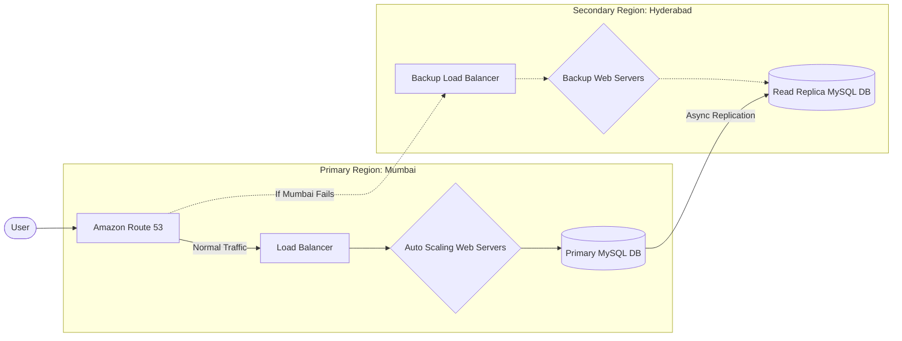

# RAHAT: Emergency Response Platform - Architecture & Defense Guide

Yeh document aapke teacher ko architecture samjhane aur cross-questions (viva) defend karne ke liye hai. Isey bas dhyan se padh lijiye!

## 1. Flowchart of Architecture

---

## 2. 1-Minute Hinglish Explanation (The Pitch)
"Sir/Ma'am, hamara project RAHAT ek Highly Available aur Disaster-Proof platform hai jo AWS par multi-region architecture follow karta hai. 

Simple terms mein: Hamara pura application **Mumbai (Primary)** region mein chal raha hai aur iska ek exact copy **Hyderabad (Secondary)** region mein bhi ready rakha gaya hai. 
Amazon Route 53 continuous health-checks karta hai. Agar Mumbai ke servers down ho jate hain, toh Route 53 apne aap sara traffic Hyderabad bhej deta hai bina kisi human intervention ke. Sath hi, hamara database (RDS) lagatar Hyderabad mein data replicate kar raha hai, jisse emergency ke waqt bhi data loss na ho aur hamari application 24/7 chalti rahe."

---

## 3. Why These Specific AWS Services? (Defend Your Architecture)

Agar teacher puche *"Kyun use kiya ye service? Alternative kyun nahi?"*:

*   **EC2 + Auto Scaling Group (ASG) kyu? (Alternative: AWS Lambda / Serverless)**
    *   *Defense:* Hume apne OS (Ubuntu) aur systemd background processes par full control chahiye tha. ASG ensure karta hai ki agar achanak se traffic badh jaye, toh naye servers apne aap scale up (ban) jayein.
*   **Application Load Balancer (ALB) kyu? (Alternative: API Gateway / NGINX on EC2)**
    *   *Defense:* ALB AWS ka native layer-7 load balancer hai jo HTTP/HTTPS traffic ke liye optimized hai. Yeh humare EC2 Auto Scaling ke sath out-of-the-box integrate ho jata hai, jabki NGINX manually manage karna padta.
*   **RDS MySQL kyu? (Alternative: DynamoDB / MongoDB)**
    *   *Defense:* Humara data highly structured hai (Incidents, unke locations, users). Relational Database (SQL) queries ke liye best hai. RDS hume automated backups aur cross-region read replicas deta hai bina kisi complex setup ke.
*   **Route 53 kyu? (Alternative: Godaddy DNS / Cloudflare)**
    *   *Defense:* Route 53 AWS resources ke sath deeply integrated hai. Isme "Health Checks" ka feature hai, yaani woh pehle check karta hai ki ALB zinda hai ya nahi, aur agar nahi toh traffic dusre server pe "Failover" kar deta hai.

---

## 4. Networking Strategy (Keep it Simple)
*   **VPC (Virtual Private Cloud):** Humne apna ek isolated network banaya hai.
*   **Public vs Private Subnets:** Security ke liye hamare EC2 servers aur Database **Private Subnets** mein hain. Unko internet se direct koi access nahi kar sakta.
*   Sirf **Load Balancer (ALB)** Public subnet mein hai. User ka traffic pehle ALB pe aata hai, aur ALB secure tarike se traffic private EC2 servers ko bhejta hai.
*   *Alternative defense (Kyun direct sab Public me nahi dala?):* Agar sab kuch Public Subnet me daal dete, toh hackers seedha Database ya EC2 instances par attack kar sakte the. Private subnets me dalne se ek "Defense in Depth" (double security layer) create ho jati hai.

---

## 5. Deployment Strategy
*   **Kaise deploy hota hai code?** 
    Code aur dependencies pehle Amazon S3 bucket mein zip ban ke upload hoti hain. Fir hum **AWS Systems Manager (SSM)** ka use karte hain EC2 servers ko command bhejne ke liye. EC2 server S3 se naya code download karta hai aur bina system crash hue background mein process restart kar deta hai.
*   **Blue-Green Deployment:** Hume zero-downtime chahiye tha. Toh naya code deploy karte waqt hum ALB pe rules change karke traffic naye (Green) servers pe shift kar dete hain. Agar naya code phat gaya, toh instantly purane (Blue) servers pe rollback kar sakte hain.
*   *Alternative defense (Kyun AWS CodeDeploy ya Jenkins nahi use kiya?):* Humari web application lightweight hai. CodeDeploy ya Jenkins jaisi CI/CD pipeline set karne me bahut time, agents, aur maintenance lagti hai. **SSM (Systems Manager)** directly EC2 ke andar secure tarike se commands run kar sakta hai jo ki fast, simple, aur cost-effective hai.

---

## 6. Disaster Recovery (DR) Strategy
*   Humari strategy ka naam hai **"Active-Passive Multi-Region DR"**.
*   Mumbai (ap-south-1) humara **Active** environment hai jaha sara live traffic ja raha hai.
*   Hyderabad (ap-south-2) humara **Passive** environment hai jo hamesha ready baitha hai.
*   RDS database apne aap lagatar (asynchronously) Hyderabad ke Read Replica mein copy ho raha hai.
*   Agar Mumbai paani me doob gaya (Region Outage), Route 53 DNS traffic Hyderabad redirect karega, aur hum 1-click se Hyderabad ke Database ko "Promote" karke Primary Master database bana denge.
*   *Alternative defense (Kyun Active-Active architecture nahi use kiya?):* Active-Active me dono (Mumbai aur Hyderabad) pe live traffic bhejna padta hai aur database ko bhi real-time me dono jagah likhna (Multi-Master) padta hai. Yeh bohot zyada costly aur highly complex hota hai. Ek college/emergency project ke liye Active-Passive best balance hai cost aur safety (Disaster Recovery) ke beech me!
